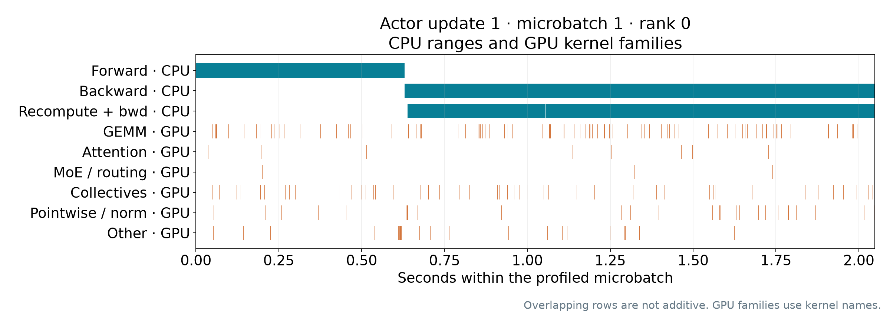

# GB300 actor window: Rubin comparison pending

This is actual diagnostic evidence from `actor-profile-gb300-j2208879-v2`.
The four-GPU replay completed four full optimizer updates. The trace captures
rank 0, update 1, microbatch 1 (0-based): four sequences, 4,096 total tokens.
The initial-policy rollout batch is frozen for the later Rubin replay.

CPU elapsed forward/backward: **629.904 / 1,417.741 ms**. Backward includes
checkpoint recomputation. GPU kernel interval union is **294.188 ms** within
the **2,048.494 ms** instrumented CPU window; this is trace coverage, not
physical utilization. Gaps cannot all be assigned to host launch overhead.
Most backward work runs on an autograd thread, so the tiny GPU value directly
linked to the outer backward range must not be treated as total backward cost.
Optimizer and final gradient synchronization are not captured; pure recompute
is not independently timed. The single-rank window is not the all-rank critical
path and cannot yet explain the full main actor-stage ratio.

Unprofiled full updates 2/3: **46.74766 / 44.95255 seconds** (slowest rank).
All 16 rank-update results are NORMAL with positive finite gradients. These
initial-policy diagnostic times are separate from the main 48-rollout cohort.

The main cohort differs by only **0.309%** in reported prompt+response tokens
and **0.474%** in logged scheduled microbatches. Its actor ratio changes from
**1.7733×** to **1.7678×** after descriptive native-token normalization; this
does not measure padding, recomputation, routing or hardware-only effects.

The compressed Chrome trace is included in the offline slides package and
retained at:
`dl3:/home/scratch.kaixih_ent/repro/miles-actor-update/20260916-gb300-j2208879/phases/replay-v2/node-output/actor-profile/rank0/actor-update.json.gz`

Trace SHA256: `db4fa4de886985e968e0311dd2cf828235359e0446bfddb5e910603d9138c7c7`.
Its full raw JSON and all four-rank packing/timing receipts are retained in the
same durable phase. The GB300 allocation has been released. Rubin remains
queued as job 2208878; no paired actor-window ratio is claimed.

See the source [capture audit](capture-audit.json), [independent trace QC](independent-trace-qc.json),
[main workload audit](main-workload-audit.json) and [file checksums](sha256.json).
