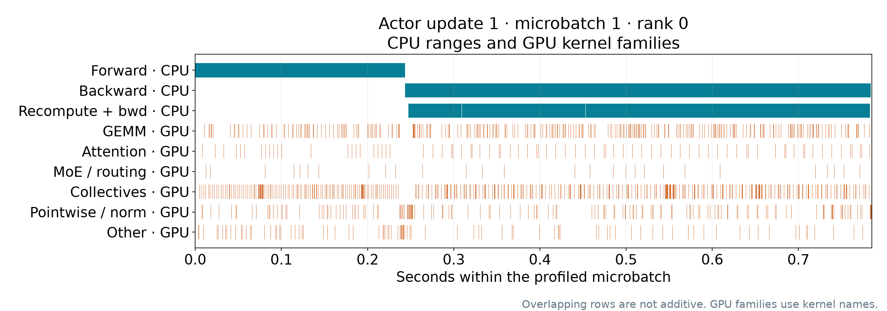

# Rubin actor evidence: one verified microbatch

This folder contains actual retained evidence from `actor-profile-rubin-j2208878-v1`.
The capture receipt is COMPLETE and source/destination retention hashes match.
**Independent trace QC and the cross-platform pairing audit passed.** The
paired audit verifies the same frozen batch, initial construction, reviewed
recipe, selected sample/token order and all four-rank packing. It does not
establish byte-identical post-warmup state or a hardware-only cause.

The selected window is **one forward/backward microbatch** on rank 0:
4 sequences, 4,096 total tokens (3,644 response tokens). Exact capture indices
are update 1, microbatch 1 (zero-based); selected sample IDs and token hashes
remain in [the native receipt](capture-receipt.json).

The retained analysis reports **785.336 ms total**, including **243.569 ms
forward** and **540.300 ms backward** CPU annotation elapsed time. Backward
includes checkpoint recomputation. Within that same window, recorded GPU kernel
intervals cover **431.994 ms (55.0%)**. This is trace interval coverage,
not physical GPU utilization, occupancy, or a measurement of all four ranks.
Profiler instrumentation and boundary synchronization affect elapsed time;
uncovered time has not been assigned to a hardware or host cause.

Optimizer and final gradient synchronization are **outside** this window.
Pure recomputation is not independently timed. Nested CPU ranges and GPU kernel
families can overlap and must not be added. The timeline's kernel-family labels
use kernel-name classifications; they are not independent exclusive phase costs.
No whole-update time, main-stage ratio or extrapolation is included here.

The [compact analysis](actor-analysis-summary.json) retains numerical summaries,
omits dense timeline/proof-example arrays and limits the kernel list to ten.
The PNG is copied byte-for-byte from the actual source-trace rendering. Full
analysis, compressed trace and four-rank packing/timing receipts remain in the
offline evidence bundle and durable phase:

`dl3:/home/scratch.kaixih_ent/repro/miles-actor-update/20260916-rubin-j2208878/phases/replay-v1/node-output`

Trace SHA256: `c604e788d708f0a2d95d1e0d40d7b3a9ee0751cd247a23fd2b24704f1e3f677f`.

[Retention receipt](retention.json) · [Source paths and hashes](source-provenance.json) ·
[File checksums](sha256.json)

[Independent trace QC](independent-trace-qc.json) and the complete
[paired workload audit](pairing-audit.json) retain their original source hashes
and numerical bindings. The latter includes raw whole-update audit records for
provenance; the explanation here remains **one microbatch only**.

See the corresponding [GB300 window](../gb300-v2/README.md). Software stacks
differ, and post-warmup state equality remains unverified. No hardware-only
explanation is inferred from these two instrumented windows.
