# Training Workflow - Qwen3-4B Example

This document illustrates the training workflow using the `run-qwen3-4B_4xgpu.sh` configuration as a concrete example.

## Configuration Overview

**Hardware Setup:**
- 4 GPUs (CUDA_VISIBLE_DEVICES=4,5,6,7)
- Colocated: Training and Inference share the same GPUs

**Model:** Qwen3-4B
- 36 layers, 2560 hidden size
- 32 attention heads, 8 query groups (GQA)
- Tensor Parallel = 2, Sequence Parallel enabled

**Training Configuration:**
- 3000 rollout iterations
- Batch size: 32 prompts × 8 samples = 256 responses per rollout
- Global batch size: 256 (balanced data)
- Math reasoning task (dapo-math-17k dataset)
- GRPO advantage estimator
- Evaluation every 20 rollouts on AIME-2024

**Memory Strategy:**
- Colocated mode: Training and Inference ping-pong on same GPUs
- Dynamic batch size with 9216 max tokens per GPU
- Gradient checkpointing (recompute 1 layer)

---

## Detailed Workflow Diagram

```mermaid
flowchart TD
    Start([Ray Job Submitted]) --> Setup
    
    Setup["<b>INITIALIZATION PHASE</b><br/>────────────────────<br/>• Configure logger<br/>• Create Ray placement groups (4 GPUs)<br/>• Init WandB tracking"]
    
    Setup --> CreateRM["<b>CREATE ROLLOUT MANAGER</b><br/>────────────────────<br/>• SGLang Engine: 2 GPUs/engine → 2 engines<br/>• Load Qwen3-4B model (TP=2)<br/>• Router: miles-router<br/>• Max response length: 8192"]
    
    CreateRM --> CreateModels["<b>CREATE TRAINING MODELS</b><br/>────────────────────<br/>Actor Model:<br/>• Qwen3-4B on 4 GPUs (TP=2, SP=True)<br/>• Megatron-LM backend<br/>• Adam optimizer (lr=1e-6)<br/>• Load from checkpoint"]
    
    CreateModels --> InitWeights["<b>WEIGHT SYNC #1</b><br/>────────────────────<br/>Copy actor weights<br/>Training → SGLang Engines"]
    
    InitWeights --> LoopStart["<b>TRAINING LOOP START</b><br/>────────────────────<br/>rollout_id = 0 to 2999"]
    
    LoopStart --> EvalInit{rollout_id == 0?}
    EvalInit -->|Yes| Eval0["<b>INITIAL EVALUATION</b><br/>────────────────────<br/>• Dataset: AIME-2024<br/>• 16 samples per prompt<br/>• Max length: 16384<br/>• Log to WandB"]
    EvalInit -->|No| Generate
    Eval0 --> Generate
    
    Generate["<b>GENERATION PHASE</b><br/>────────────────────<br/>SGLang Inference:<br/>• Load 32 prompts from dapo-math-17k<br/>• Apply chat template<br/>• Generate 8 responses/prompt<br/>• Temperature: 0.8<br/>• Reward: DeepScaler RM<br/>• Output: 256 rollout samples"]
    
    Generate --> OffloadInf["<b>MEMORY: Offload Inference</b><br/>────────────────────<br/>Free 2 engines from GPU<br/>(Colocated: make room for training)"]
    
    OffloadInf --> Train["<b>TRAINING PHASE</b><br/>────────────────────<br/>Actor Training (4 GPUs):<br/>• Input: 256 balanced samples<br/>• GRPO advantage estimation<br/>• KL loss (coef=0.0)<br/>• Clip: [0.2, 0.28]<br/>• Dynamic batch (9216 tokens/GPU)<br/>• Gradient accumulation + allreduce"]
    
    Train --> SaveCheck{rollout_id % 20 == 0?}
    
    SaveCheck -->|Yes| SaveModel["<b>CHECKPOINT SAVE</b><br/>────────────────────<br/>• Save actor model<br/>• Path: /root/Qwen3-4B_miles/"]
    SaveCheck -->|No| OffloadTrain
    SaveModel --> OffloadTrain
    
    OffloadTrain["<b>MEMORY: Offload Training</b><br/>────────────────────<br/>Clear training model memory<br/>(Colocated: make room for inference)"]
    
    OffloadTrain --> ReloadInf["<b>MEMORY: Reload Inference</b><br/>────────────────────<br/>Load weights to SGLang engines"]
    
    ReloadInf --> WeightSync["<b>WEIGHT SYNC #2</b><br/>────────────────────<br/>Copy updated actor weights<br/>Training → SGLang Engines"]
    
    WeightSync --> EvalCheck{rollout_id % 20 == 0?}
    
    EvalCheck -->|Yes| Eval["<b>PERIODIC EVALUATION</b><br/>────────────────────<br/>• Dataset: AIME-2024<br/>• Log accuracy to WandB<br/>• Compare vs baseline"]
    EvalCheck -->|No| LoopCheck
    Eval --> LoopCheck
    
    LoopCheck{rollout_id < 2999?}
    LoopCheck -->|Yes| Generate
    LoopCheck -->|No| Cleanup
    
    Cleanup["<b>CLEANUP</b><br/>────────────────────<br/>• Dispose rollout manager<br/>• Shutdown SGLang engines<br/>• Close Ray actors"]
    
    Cleanup --> End([Training Complete])
    
    style Setup fill:#e1f5ff
    style CreateRM fill:#fff4e6
    style CreateModels fill:#fff4e6
    style Generate fill:#e8f5e9
    style Train fill:#ffebee
    style OffloadInf fill:#f3e5f5
    style OffloadTrain fill:#f3e5f5
    style WeightSync fill:#fff9c4
    style Eval fill:#e0f2f1
    style SaveModel fill:#fce4ec
```



---

## Timeline Breakdown

### Single Rollout Iteration (~1-2 minutes)

```
┌─────────────────────────────────────────────────────────────────────┐
│  ITERATION N (e.g., rollout_id = 100)                               │
└─────────────────────────────────────────────────────────────────────┘

[0s────────10s───────20s──────30s──────40s──────50s──────60s─────→]
│          │         │        │        │        │        │
│  GENERATE (SGLang) │ TRAIN  │ SYNC   │ (next iteration)
│  32 prompts        │ GRPO   │ Weights│
│  × 8 samples       │ 4 GPUs │        │
│  = 256 responses   │        │        │
│                    │        │        │
└─ GPU: Inference ──┘└─ GPU: Training ┘└─ GPU: Inference ───→


Memory View (Colocated):
────────────────────────
GPU 4-5: [SGLang Engine #1 (TP=2)    ]      [Freed] [Training] [SGLang]
GPU 6-7: [SGLang Engine #2 (TP=2)    ]      [Freed] [Training] [SGLang]
         └─ Generation Phase (10-20s) ┘      └─ Training Phase (20-30s) ┘
```

### Every 20 Rollouts (Evaluation + Checkpoint)

```
Rollout 20, 40, 60, ... 2980, 3000:
├─ Save checkpoint to /root/Qwen3-4B_miles/
├─ Run evaluation on AIME-2024
├─ Log metrics to WandB
└─ Continue training
```

---

## GPU Memory Layout (Colocated Mode)

```
┌─────────────────────────────────────────────────────────────────┐
│  4 GPUs (CUDA_VISIBLE_DEVICES=4,5,6,7)                          │
└─────────────────────────────────────────────────────────────────┘

During GENERATION:
┌─────────────┬─────────────┬─────────────┬─────────────┐
│   GPU 4     │   GPU 5     │   GPU 6     │   GPU 7     │
├─────────────┼─────────────┼─────────────┼─────────────┤
│  SGLang     │  SGLang     │  SGLang     │  SGLang     │
│  Engine #1  │  Engine #1  │  Engine #2  │  Engine #2  │
│  (TP=2)     │  (TP=2)     │  (TP=2)     │  (TP=2)     │
│  ─────────  │  ─────────  │  ─────────  │  ─────────  │
│  Weights    │  Weights    │  Weights    │  Weights    │
│  KV Cache   │  KV Cache   │  KV Cache   │  KV Cache   │
│  CUDA Graph │  CUDA Graph │  CUDA Graph │  CUDA Graph │
└─────────────┴─────────────┴─────────────┴─────────────┘

During TRAINING:
┌─────────────┬─────────────┬─────────────┬─────────────┐
│   GPU 4     │   GPU 5     │   GPU 6     │   GPU 7     │
├─────────────┼─────────────┼─────────────┼─────────────┤
│  Megatron   │  Megatron   │  Megatron   │  Megatron   │
│  Actor      │  Actor      │  Actor      │  Actor      │
│  (TP=2,SP)  │  (TP=2,SP)  │  (TP=2,SP)  │  (TP=2,SP)  │
│  ─────────  │  ─────────  │  ─────────  │  ─────────  │
│  Weights    │  Weights    │  Weights    │  Weights    │
│  Gradients  │  Gradients  │  Gradients  │  Gradients  │
│  Activations│  Activations│  Activations│  Activations│
│  Optimizer  │  Optimizer  │  Optimizer  │  Optimizer  │
└─────────────┴─────────────┴─────────────┴─────────────┘
```

---

## Key Design Decisions

### 1. **Colocated Architecture**
- **Why**: Efficient GPU utilization for small-scale setups
- **How**: Training and inference alternate (ping-pong pattern)
- **Trade-off**: Sequential execution (slower) vs GPU efficiency (higher)

### 2. **Tensor Parallelism = 2**
- **Why**: Qwen3-4B fits in 2 GPUs per instance
- **Result**: 
  - Training: 1 actor model across 4 GPUs (TP=2)
  - Inference: 2 SGLang engines, each across 2 GPUs (TP=2)

### 3. **Batch Size Strategy**
- **Rollout**: 32 prompts × 8 samples = 256 responses
- **Training**: Global batch 256, dynamically packed to 9216 tokens/GPU
- **Why**: Balance between diversity and training stability

### 4. **GRPO (Group Relative Policy Optimization)**
- Computes advantages using group statistics
- KL coefficient = 0.0 (no explicit KL penalty)
- Clip range: [0.2, 0.28] for stability

### 5. **Weight Synchronization**
- After each training step, copy actor weights → SGLang engines
- Ensures inference uses latest policy
- Critical for on-policy RL

---

## Full Training Run

```
Total Duration: ~50-100 hours (depends on hardware)
├─ 3000 rollouts × ~1-2 min/rollout
├─ 150 checkpoints (every 20 rollouts)
├─ 150 evaluations (every 20 rollouts)
└─ WandB logs: miles-dev-qwen3-radix/qwen3-4B-4xgpu
```

**Expected Outputs:**
- Final model: `/root/Qwen3-4B_miles/`
- Checkpoints: Every 20 rollouts
- Metrics: WandB dashboard with AIME-2024 accuracy curve
- Total training samples: 3000 × 256 = 768,000 responses

---

## Command Reference

**Start Training:**
```bash
./scripts/run-qwen3-4B_4xgpu.sh
```

**Key Arguments:**
- `--actor-num-nodes 1 --actor-num-gpus-per-node 4`: 4 GPUs for training
- `--colocate`: Share GPUs between training and inference
- `--rollout-num-gpus-per-engine 2`: 2 GPUs per SGLang engine
- `--tensor-model-parallel-size 2`: TP=2 for both training and inference
- `--num-rollout 3000`: 3000 iterations
- `--global-batch-size 256`: 256 samples per training step

**Monitor:**
```bash
# Ray dashboard
http://127.0.0.1:8265

# WandB
wandb.ai/your-team/miles-dev-qwen3-radix/qwen3-4B-4xgpu
```

